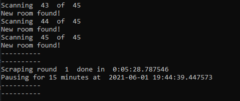

# ROOMScanner

This script can be used to scrape the available rooms on [ROOM.nl](ROOM.nl). This script was made because I was looking for a room and wanted to scan the progress my rank made over time (how my chance of getting a room improved). Later I also added notification mails to it so in case new "Direct offer" rooms were available I would get a mail and could apply to the room asap to have a high chance of getting the room.

## Installation and set-up

This script works using Python 3.7+.

1. Make sure you have a chromium browser
2. Clone the repository
3. Install selenium by using: `pip install selenium`
4. Add the chromedriver.exe file that supports your chromium version from https://chromedriver.chromium.org/downloads into the root folder of the repository
5. Enter your credentials and preferred settings in importTool.py in the Set-up section
6. Run importTool.py

## Functionalities

- Scan available rooms on [ROOM.nl](ROOM.nl) and save them in a CSV file
- Notify user when new rooms are added

## Example results

Logging in command line:



Example result after converting the CSV rows to JSON:

```json
[
  {
    "timestamp": "2020-10-31 21:40:44.554083",
    "link": "https://www.room.nl/aanbod/studentenwoningen/details/30043-vandervennestraat-36--b-denhaag",
    "rank": 23,
    "total_responses": 23,
    "offer_type": "Direct offer",
    "roommates": "5 bewoners",
    "prijs": "312,92",
    "huurtoeslag": "Geen huurtoeslag"
  },
  {
    "timestamp": "2021-06-01 19:55:18.020161",
    "link": "https://www.room.nl/aanbod/studentenwoningen/details/45276-galgewater-1-leiden",
    "rank": 1,
    "total_responses": 1,
    "offer_type": "Inschrijfduur",
    "roommates": "zelfstandig",
    "prijs": "795,00",
    "huurtoeslag": "Geen huurtoeslag"
  }
]
```

## Known bugs

- Rooms that you cannot reply to will not be added to the dataset (e.g. if you had already applied for the room or you do not match the requirements)
- Keep in mind that front-end DOM of websites can change without any notice and this script may not work properly after that. To make it work again the XPath of the elements need to be adjusted properly.

